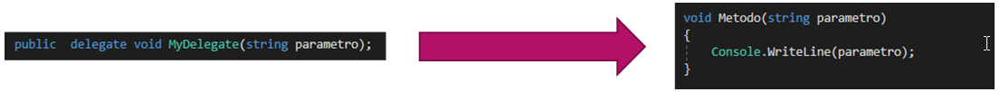
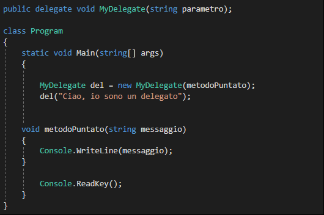

# L'utilizzo dei delegati spiegati in parole semplici

## Il delegato
Innanzitutto vorrei dire che capire il funzionamento dei "**delegati**" non è molto semplice, almeno io c'ho messo parecchio tempo sposare il concetto dei delegati.
Purtroppo gli esempi nei vari libri che si trovano sul mercato sono spesso troppo complessi
Per questo motivo ho deciso di dedicare un capitolo intero sui delegati nella Wiki spiegando il loro funzionamento con dei esempi di base.

Il concetto dei delegate non è nuovo nella programmazione, anzi si usa da oltre mezzo secolo noto come un puntatore a funzione in C e C++.
Ma come noi sappiamo, in C# tutto è orientato agli oggetti senza eccezione, perciò anche i delegati sono orientati agli oggetti, questo il motivo che gli rende indipendenti e sicuri.

La definizione ufficiale di un delegato è:
**Un delegato è un tipo sicuro che rappresenta un riferimento ad un metodo con un elenco di parametri e un tipo restituito particolare.**

 

Ma io direi che è più facile a capire se la dico così:
_Un delegato è un tipo che punta su un metodo._

**La firma del delegato deve corrispondere con la firma del metodo da incapsulare.**

L’uso del delegato è simile all’uso della classe. Infatti è possibile istanziarlo passandoli il nome del metodo come parametro.
La sintassi del delegato è simile al quella del metodo aggiungendo la parola chiave «delegate»

`public delegate void MyDelegate(string parametro);`

Abbiamo creato un delegato con il nome "`MyDelegate`", assomiglia ad un metodo, ma non contiene nessun blocco di codice, infatti è una referenza ad un metodo.
In questo esempio non abbiamo un valore di ritorno, si capisce della parola chiave void. Ovviamente i delegato potrebbero avere un valore di ritorno, ma nel nostro caso non ce l'ha, però ha un parametro del tipo string.

Allora dato che abbiamo detto che un delegate è un puntatore ad un metodo, dobbiamo creare anche il metodo.


```
void metodoPuntato(string messaggio)
{
    Console.WriteLine(messaggio);
}
```


Questo è un metodo veramente facile da capire scrive un messaggio sulla consolle.
Come notiamo, il metodo corrisponde alla firma del delegato: Nessun valore di ritorno (void) e si aspetta un parametro del tipo string.
Allora il nostro delegato che abbiamo dichiarato in precedenza si lascia comodamente usare per effettuare incapsulare il metodo.


```
MyDelegate del = new MyDelegate(metodoPuntato);
del("Ciao, io sono un delegato");
```

Prima di tutto creiamo un istanza del delegato. Abbiamo detto che possiamo usarlo come una classe, cioè istanziarlo e passarli al costruttore il nome del metodo che referenziamo.
Dopo chiamiamo il delegato passandoli il valore del parametro richiesto del metodo referenziato.

E per concludere il codice completo



## Fonti
https://docs.microsoft.com/it-it/dotnet/csharp/programming-guide/delegates/using-delegates
Libri C#


## Feeback
Ho potuto aiutarti con questo articolo? Likami su facebook.
[gimmick:FacebookLike](http://www.facebook.com)

Vuoi sentire di più da me? Seguimi su twitter.
[gimmick:TwitterFollow](@timodoerr)

Hai voglia di discutere?
[gimmick:Disqus](your_disqus_shortname)

