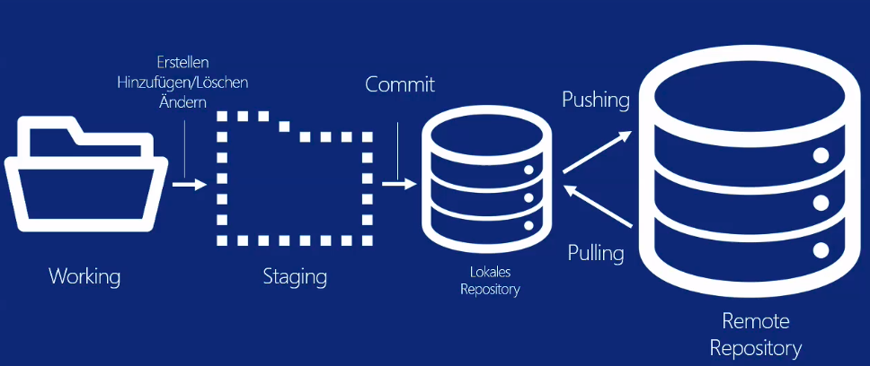

Git Mini HowTo
=================

Questo file è stato scritto per imparare ad usare git.
Autore: Adrian Unterfinger
Data: 4 giungno 2014

Note! Questo file non è stato ancora tradurre in italiano.

## La Base

### Configurazione globale

`git config --global user.name "Adrian Unterfinger"`  
`git config --global user.email "wuenci[at]msn.com"`  
```
Il path del file di configurazione si trova nella %HOMEPATH%\.gitconfig
```

### Lo schema funzionalità base


## Working and Staging

### Inizializzare un progetto
Cambiare nella cartella desidereta e scrivere seguente comando:  
`git init`


### Visualizzare i log
`git log`  


###  Visualizzare lo stato
`git status`  

### Visualizzare lo stato sul branch remoto
`git remote update && git status`  


### Aggiungere un file
`git add helloworld.c`  
oppure tutti i file con estensione "c":  
`git add *.c`  


### Aggiungere nello staging tutti i file
`git add -A`  
oppure:  
`git add .`  

### Aggiungere nello staging tutte i file che hanno avuto delle modifiche
`git add -u`  


### Commitare:
`git commit -m "initial commit"`  
oppire:  
`git commit`  

### Eliminare file in git e sul filesystem
`git rm -f unusedfile.c`  

### Änderungen egal welcher natur unbedingt zurücksetzten
`git reset HEAD --hard` (HEAD = Letzte bekante version)

## Remotes con Push e Pulling

### Aggiungere un remote
`remote add origin git@github.com:wuenci/makefileex.git`

### Pushing (caricare sul remote)
`git push origin master`  

### Pulling (scaricare dal remote)
`git pull origin master`  

Note! Git pull o push fa un git fetch seguito da una git merge  

### Creare un Brunch
`git branch [nome_del_branch]`

### Visualizzare il Branch attuale
`git branch` -> Visulaizza quelli locali  
`git branch -r` -> Visulaizza i branch remoti  
`git branch -a` -> Visulaizza tutti i branch  

### Cambiare Branch
`git checkout -b [nome_del_branch]`  
Questo comando rimpiazza gli attuali files nella cartella corrente di lavoro.  

### Creare Tags
`git tag 1.0`  
Crea un Tag di nome 1.0 dal brunch attuale  

## Rebasing e Stashing

### Fetching (scaricare senza riconciliare )
`git fetch origin`  
Scarica tutti i remote branch senza riconciliare con la cartella di lavoro.  

_Git fetch lo puoi fare un in qualsiasi momento per rappresentare localmente in  `refs/remotes/[remote]/` i tuoi rami di tracciamento remoti.  
Questa operazione non cambia nessuno dei tuoi rami locali sotto `refs/heads`, perciò è sicuro da fare senza cambiare la tua copia di lavoro._  

### Rebase
`git rebase [-i]` (i = Specificare la interactivity)  
`git rebase -i --onto master remote/master`  
Rebase ti permette di allienare la commit history nella sequenza desiderata sul tuo repository.  
Funziona solo per allienare repos locali _(scaricati con fetch)_, mai per quelli gia caricati sul remote.  
_In altre parole ti permette di scegliere le modifiche che sono state effettuate su un branch remoto che non è più allienato al tuo locale. In caso un collega ha gia fatto un push dei suoi lavori._ 

## Merge
`git merge [branchName]`  
 Merge serve per riconciliare diversi branches.  
 Il 3 way merge è il piu facile di tutto e si chiama anche fast forward.  

 

### Stash
`git stash`  
Git stash ti permette di salvare lo stato attuale senza effettuare un commit.  

`git pop`  
Git pop ti permette di riprendere uno stato salvato da git stash.

### Differenzen anzeigen
`git diff`  
`git diff a56dc182f8211932c58cea4ce4dd0`  
`git diff a56dc182f8211932c58cea4ce4dd0 helloworld.c`  


### Zu einer früheren version zurücksetzten
`git checkout a56dc182f8211932c58cea4ce4dd0`  
`git add -A`  
`git commit -m "Version fünf"`  
`git branch`  
`git checkout master`  

Note! Achtung ich befinde mich zuzeit in einem inkonsitenten zustand, das bedeutet immer noch im commit a56dc182f8211932c58cea4ce4dd0.

Um auf den master Strang zu gelangen  muss ich folendes tun:

Attention! Wichtig, nur diese Befehle nutzen:

`git revert --no-commit a56dc182f8211932c58cea4ce4dd0`  
`git commit -m "Zurückgesetzt"`  

oder auch absolot zuücksetzten:  
``git reset --hard a56dc182f8211932c58cea4ce4dd0`` (dann werden alle dazwichen gemachten commit ebenfalls gelöscht.)


## Esempi
```
BEISPIEL Stränge zusammenführen:
==================================
Branches zusammenführen:
 (in den feature Strang wechseln)
git merge master
git commit -a
git checkout master
 (in den master Strang wechseln)
git merge feature/strangname
 (es ergibt sich einen fast forward merge,
  da sich alle inkongruenzen im feature/strangname Strang aufgelöst wurden.
Den feature/formular strang löschen:
git branch -d feature/formular
```


```
GitHub:
==========

Ein bereits erstelltes Project hunzufügen:
- Das project muss auf gitlab erstellt sein.

git config --global user.name "Adrian Unterfinger"
git config --global user.email "wuenci@msn.com"
git init
git remote add origin git@github.com:wuenci/makefileex.git
git add .
git commit
git push -u origin master


Den master auf GitHub senden:
git push -u origin master
```

## Git Help
```
These are common Git commands used in various situations:

start a working area (see also: git help tutorial)
   clone      Clone a repository into a new directory
   init       Create an empty Git repository or reinitialize an existing one

work on the current change (see also: git help everyday)
   add        Add file contents to the index
   mv         Move or rename a file, a directory, or a symlink
   reset      Reset current HEAD to the specified state
   rm         Remove files from the working tree and from the index

examine the history and state (see also: git help revisions)
   bisect     Use binary search to find the commit that introduced a bug
   grep       Print lines matching a pattern
   log        Show commit logs
   show       Show various types of objects
   status     Show the working tree status

grow, mark and tweak your common history
   branch     List, create, or delete branches
   checkout   Switch branches or restore working tree files
   commit     Record changes to the repository
   diff       Show changes between commits, commit and working tree, etc
   merge      Join two or more development histories together
   rebase     Reapply commits on top of another base tip
   tag        Create, list, delete or verify a tag object signed with GPG

collaborate (see also: git help workflows)
   fetch      Download objects and refs from another repository
   pull       Fetch from and integrate with another repository or a local branch
   push       Update remote refs along with associated objects
   ```